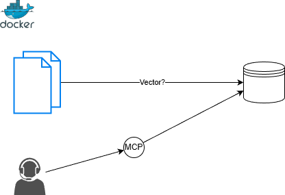

# nidus-mcp

NidusMCP is an open-source MCP server that search documents information locally.
It provides locally-restricted document search.

## Quick start
### Install globally with uv and serve

Installation:
```bash
uv tool install git+https://github.com/Kuroki-g/nidus-mcp.git
```

Init database:
```bash
nidus init --doc_dir={YOUR_DOC_DIR}
```

Run Ninus Server:
```bash
nidus serve
```

You tell AI agenet CLI by editing your `settings.json`.


```json
{
  "mcpServers": {
    "nidus": {
      "httpUrl": "http://localhost:8000/mcp",
    }
  }
}
```

#### Use docker compose

```yaml
services:
    // here your service
    // ...
    nidus:
        image: nidus:latest
        environment:
            # default: 8000
            PORT: 8000
            # DB_PATH default ./db/.lancedb
            DB_PATH: "${PWD}:./.lancedb"
        ports:
            - "8000:8000"
        volumes:
            # document directory mount
            - nidus:/docs
volumes:
    nidus_data:
```


## Arch



## License
- License: [Apache License 2.0](https://github.com/Kuroki-g/nidus-mcp/blob/main/LICENSE)
